# **如何把AlphaCore在Houdini中解算效果移植到Unreal**

## 1. 资产导出
* 将Houdini的高度场转为模型后，导出FBX文件备用
    

        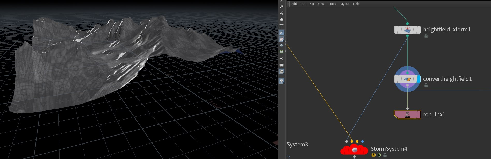
    

* 将FBX文件导入到Unreal中，并调整位置。
    

        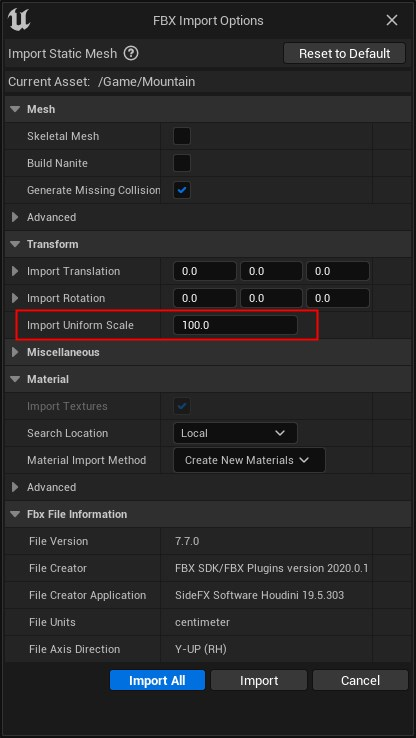
    

    

        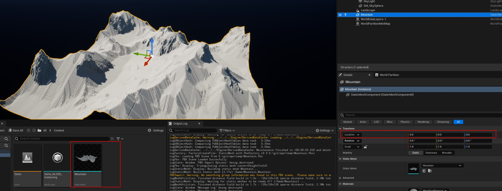
    

* 这里山的位置设置在原点，因为Houdini高度场的位置就在原点

## 2. 设置StormActor的位置及大小
* 创建StormActor
* 设置解算域位置和大小
    

        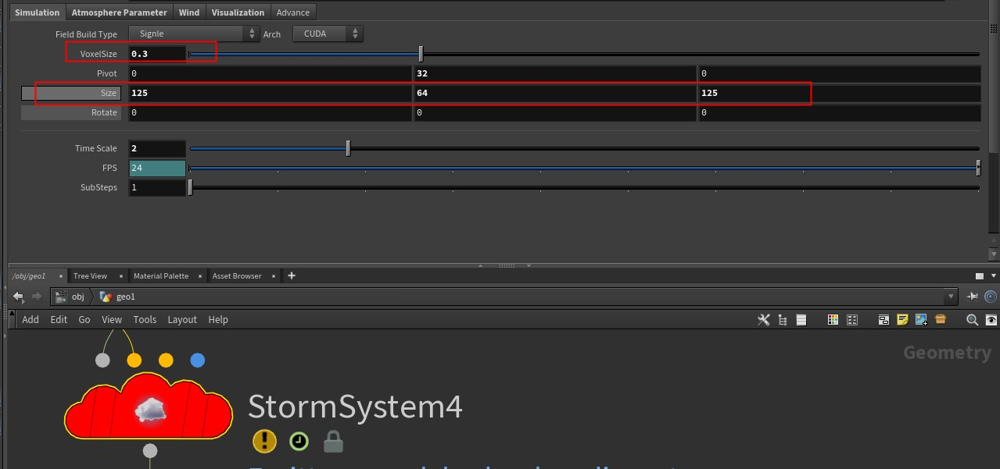
    

    

        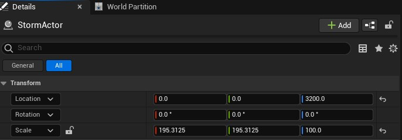
    

    Houdini的Pivot为`{0,32,0}`,由于Houdini的坐标系与Unreal有所差异，Unreal中的坐标应乘以100倍，并调换Y/Z坐标。Unreal的坐标应为`{0,0,3200}`。

    Houdini的Size为`{125,64,125}`,Unreal中Actor绑定的是UBoxComponent，默认大小为`{64,64,64}`,所以调整Unreal的Scale大小为`{125*100/64,125*100/64,64*100/64}`，即`{195.3125,195.3125,100}`

    

        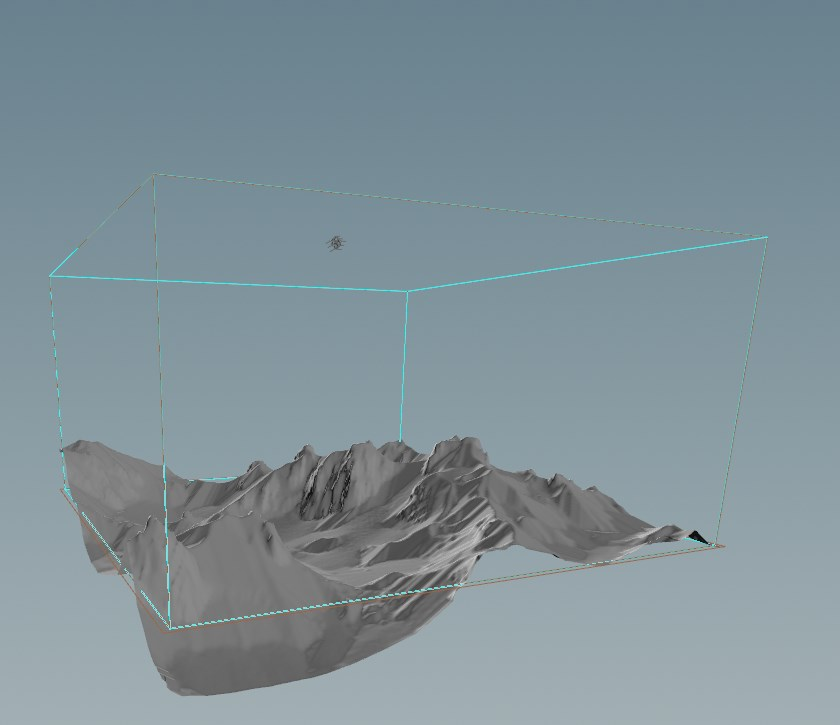
    

    

        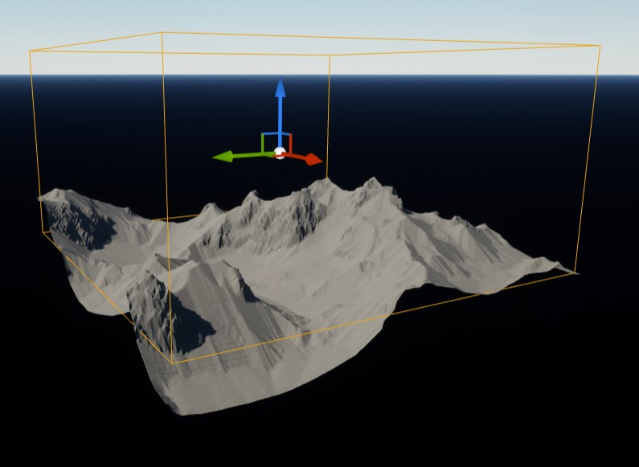
    

* Unreal中设置VoxelSize为0.3，与Houdini一致
* 将Mountain Add到StormActor中
    

        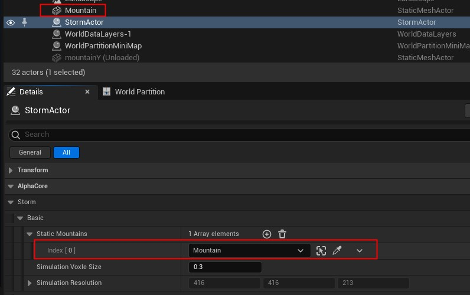
    

## 3. 设置发射器
* 将发射器添加到StormActor中
    

        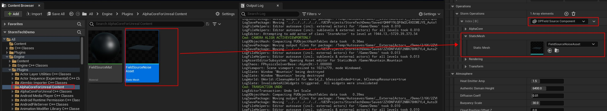
    

    由于houdini中只使用了一个发射器，Unreal中也只需添加一个发射器
    

        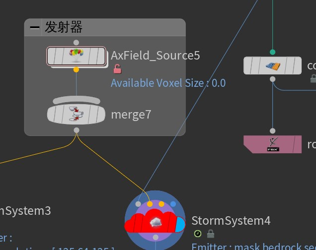
    

* 设置发射器的位置与大小
    

        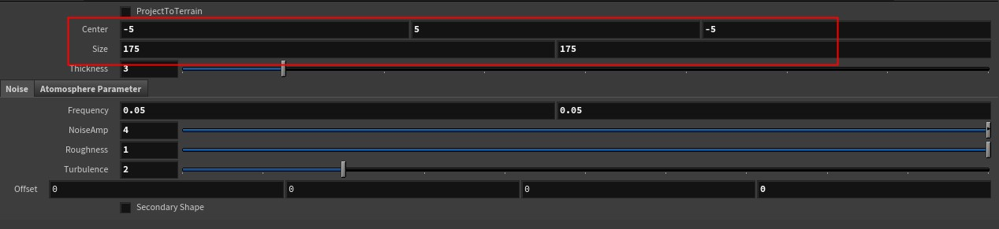
    

    与Actor位置类似，这里需要设置发射器的位置和size如图
    

        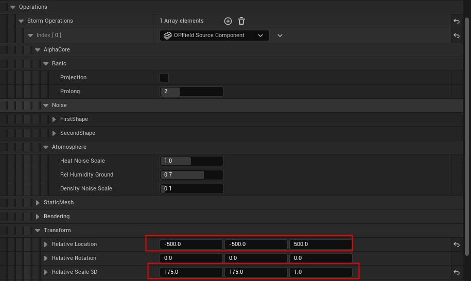
    

    Houdini与Unreal位置对比
    

        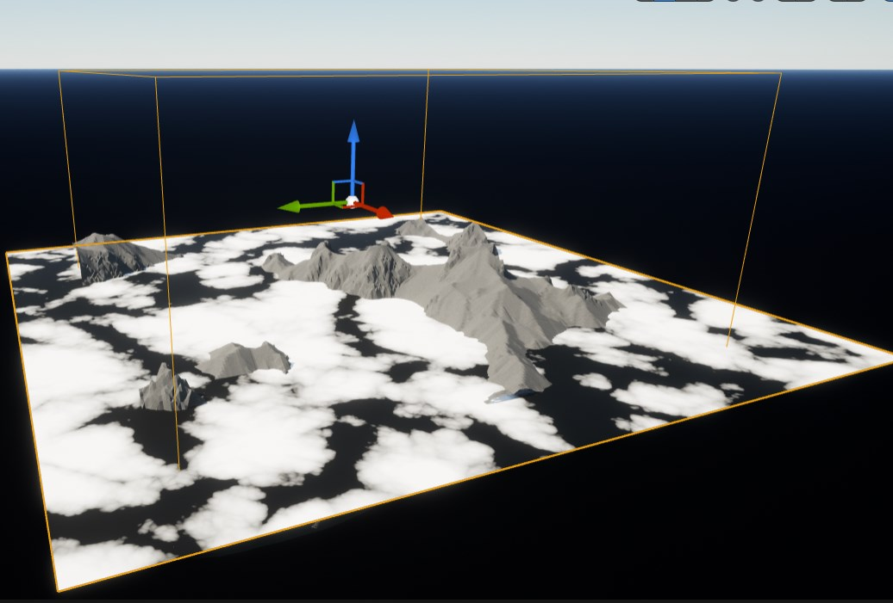
    

    

        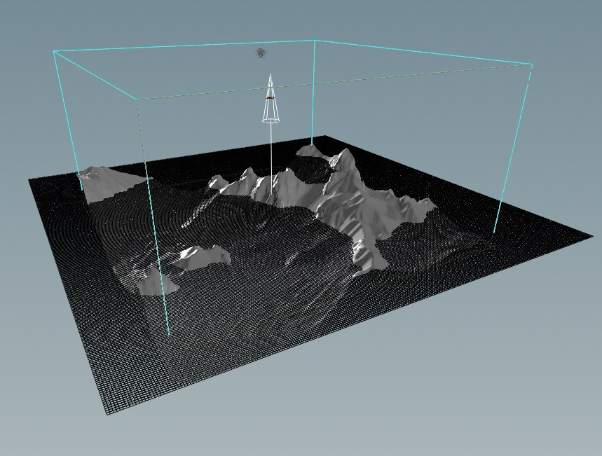
    

* 设置发射器其他参数
    

        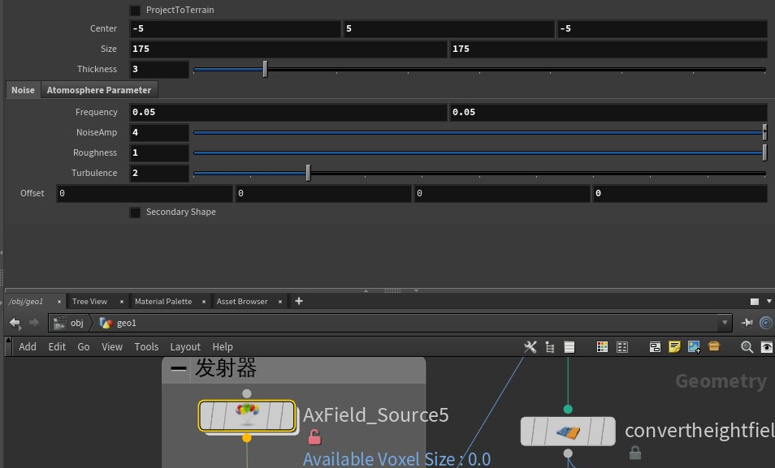
    

    

        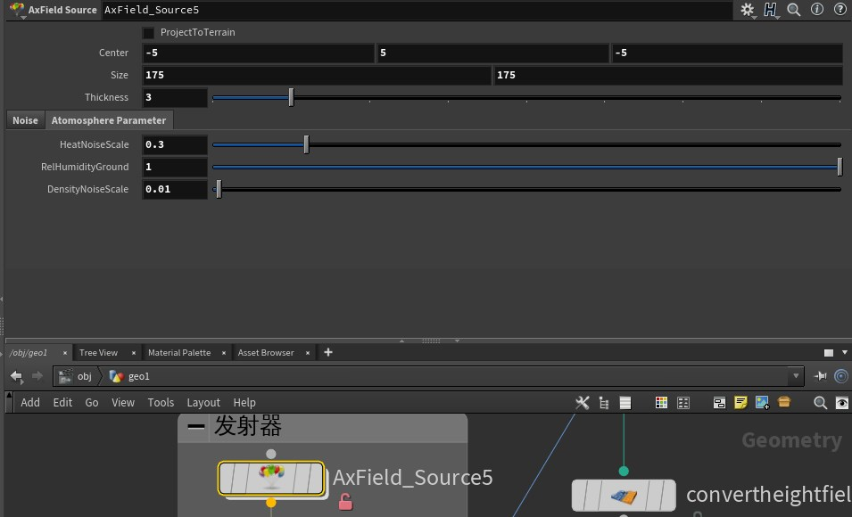
    

    

        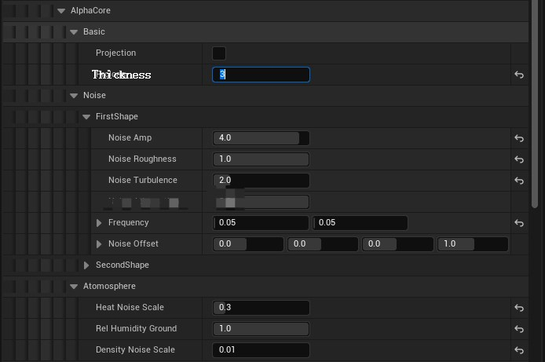
    

* 设置Actor其他参数
    

        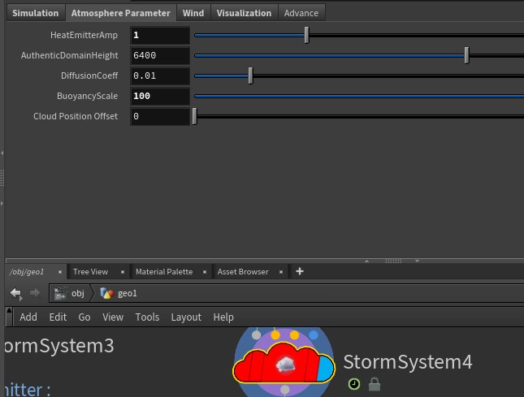
    

    

        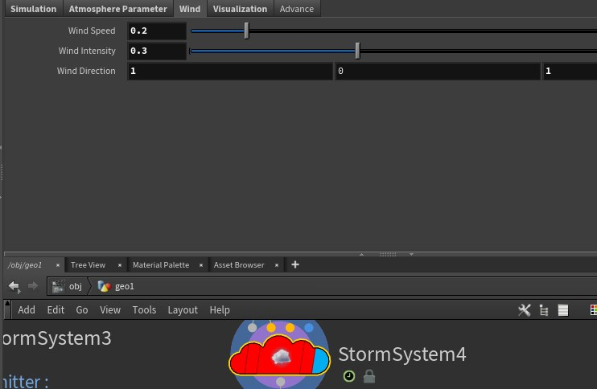
    

    

        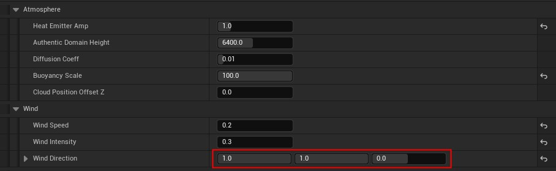
    

## 4. 效果对比

    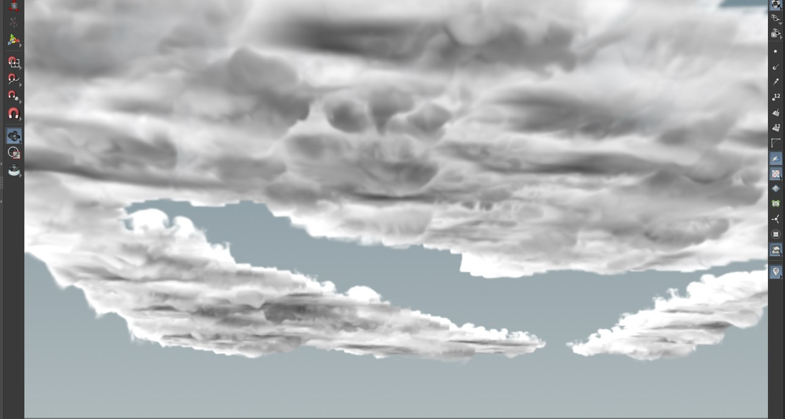

    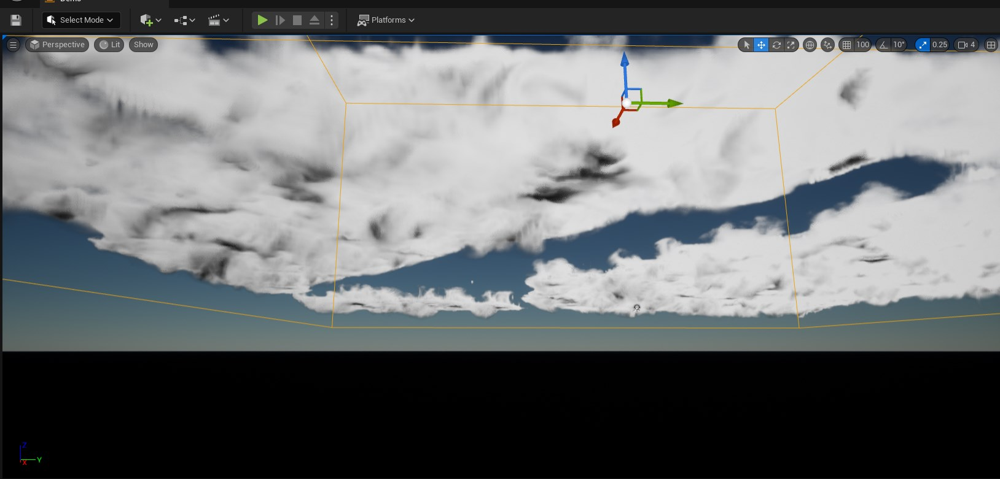

