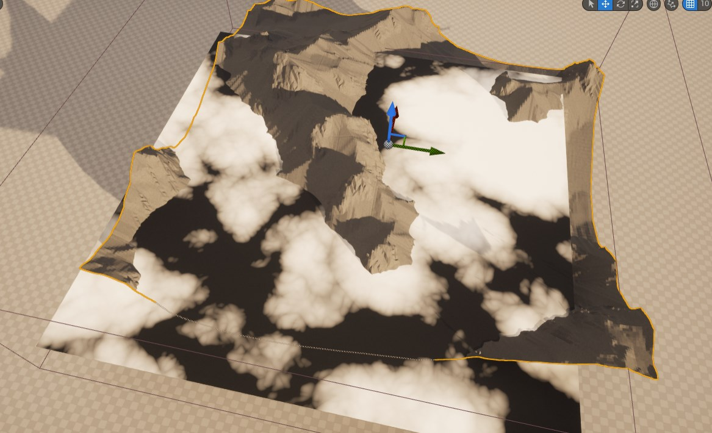

# **AlphaCore StormSystem Unreal 插件使用说明**

## 1. Unreal版本及硬件要求
* Unreal版本：FusionProj / UE 5.0.3
* CUDA版本：11.6以上
---

## 2. 插件启动
* 使用FusionProj引擎启动UE，创建新的工程文件，开启AlphaCoreForUnreal插件，并重启工程。
    

        
    

---

## 3. Actor及使用说明
### 3.1 创建StormActor

    

---
### **3.2 参数面板概述**

    

#### **3.2.1 Basic**
* Actor的BoundingBox为StormSystem的解算域，SimulationVoxelSize为解算的voxelSize，SimulationResolution为解算的网格精度。
* StaticMountains 可接受 StaticMeshActor Array，解算初始化时，这些StaticMesh的Polygon信息会转换为高度场，并在解算时与云有碰撞交互。
    

        
    

#### **3.2.2 Operations**

* Operations存储的是发射器的Array，**目前只支持OPFieldSource Component类型**，其他两种并无效果
    

        
    

* OPFieldSource Component中需要接受一个FieldSourceNoiseAsset的StaticMesh，该资产在Engine/AlphaCoreForUnreal Content 下。如图所示
    

        
    

* OPFieldSource Component参数详解见*StormSystemHDABeta1.0工具使用手册*。需要说明的是NoiseAsset的大小和位置目前并没有手柄来控制，**需要在Transfrom下手动填写数值来控制其大小及位置。**
    

        
    

* **需要说明的是UE里显示的Noise与实际解算中的Noise并不一致。UE中只是示意这是一个Noise而已，后续会考虑如何接入Unreal原生的Noise。**
    

        
    

* FieldSourceNoiseAsset在Game模式下会自动设置渲染不可见，如果在Editor模式下影响效果观察，可以在Rendering下勾选Visible为false
    

        
    

#### **3.2.3 Atomosphere and Wind**
* 该部分的参数详解见*StormSystemHDABeta1.0工具使用手册*。
    

        
    

#### **3.2.4 Render**
* Render部分采用RayMarch的渲染方式
    

        
    

* DensityScale调整渲染density的大小
* StepSize调整步进的大小
* ShadowScale调整阴影强弱
* UsePhase和phase调节phaseFunction效果
* InputDensityMinMax控制解算后数据的density大小，并重新remap到0-1的取值空间。

* 渲染效果目前只支持Unreal中的DirectionLight，后续会考虑支持环境球等
    

        
    

#### **3.2.5 Init and Clear**

* Init按钮触发AlphaCoreStormSystem的开始解算。

* Clear按钮从AlphaCore中删除该StormActor
    

        
    

    

        
    

    

        
    

#### **3.2.6 其他说明**

* StormActor支持多个Actor在场景中同时解算，但需结合性能和硬件条件谨慎使用

* Game模式下BeginPlay同Init逻辑相同，云层会重新开始解算。退出Game模式时，会Clear掉StormActor的解算缓存。

* **可实时调节参数：Atmosphere,Wind,Render目录下的参数均支持实时调节，Basic和Operation下的参数需要Clear之后重新Init来查看新的效果。**